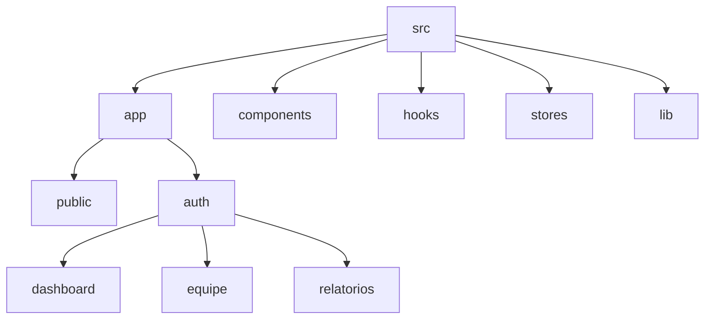

# Controle de Horários Médicos


Sistema mobile-first para registro de plantões, comparação com metas e exportação de relatórios em CSV. Construído com Next.js 14, Firebase e Tailwind.

---

## ⚡ Instalação rápida

```bash
# Requisitos: Node 20 + npm
npm install
npm run dev
```

Acesse http://localhost:3000.

---

## 📂 Estrutura de Pastas



---

## 🔧 Scripts úteis

| Comando       | Descrição                            |
| ------------- | ------------------------------------ |
| `pnpm dev`    | Executa servidor Next.js em modo dev |
| `pnpm build`  | Build de produção                    |
| `pnpm start`  | Inicia build gerado                  |
| `pnpm lint`   | Analisa lint ESLint                  |
| `pnpm test`   | Roda testes unitários Vitest         |
| `pnpm e2e`    | Executa testes Playwright            |
| `pnpm format` | Aplica Prettier                      |

---

## 🖥️ Arquitetura de Alto Nível

1. **Frontend (Next.js)** – CSR + ISR, PWA habilitado (next-pwa).
2. **Firebase Auth** – Cookie `auth-token` gerenciado pelo hook `useAuth`.
3. **Firestore** – Coleções `registros`, `equipes`, `planos` protegidas por regras baseadas em custom claims `role`.
4. **Cloud Functions** – `exportCsv`, `cleanupSoftDeleted`, `setUserRole`.
5. **CI/CD** – GitHub Actions roda lint, tests, build; fase futura implantará CD para Firebase Hosting.

---

## 🤝 Contribuindo

1. Crie branch a partir de `main`.
2. Rode `pnpm lint && pnpm test` antes do commit.
3. Abra PR referenciando a tarefa (ex.: `T3.2.1`).

---

## 📜 Licença

MIT © 2025 Paulo Otsubo
